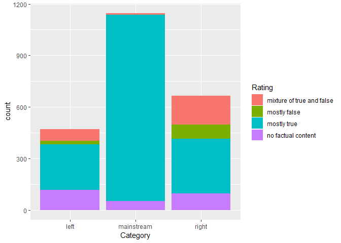

facebook\_factcheck
================

R Markdown
----------

This is an R Markdown document. Markdown is a simple formatting syntax for authoring HTML, PDF, and MS Word documents. For more details on using R Markdown see <http://rmarkdown.rstudio.com>.

When you click the **Knit** button a document will be generated that includes both content as well as the output of any embedded R code chunks within the document. You can embed an R code chunk like this:

need to write a proposal covering these questions: What is the problem you want to solve?

Who is your client and why do they care about this problem? In other words, what will your client DO or DECIDE based on your analysis that they wouldn’t have otherwise?

What data are you going to use for this? How will you acquire this data?

In brief, outline your approach to solving this problem (knowing that this might change later).

What are your deliverables? Typically, this would include code, along with a paper and/or a slide deck.

DATA WRANGLING:

Clean up your column names to be simple, short and descriptive For each column:

Check for missing values and decide what you want to do about them. Make sure the values in each column make sense. If you find values that don't, decide what you want to do about those.

Look for outliers (values that are too small or too large). Do they make sense? Do you want to keep them in the data set?

Discuss with your mentor about other data wrangling steps you might need to perform for your specific problem and implement those. Save your cleaned up and transformed data set.

Possible questions:

How do left, mainstream, and right categories of Facebook pages differ in the stories they share?

Which types of stories receive the most engagement from their Facebook followers? Are videos or links more effective for engagement?

Can you replicate BuzzFeed’s findings that “the least accurate pages generated some of the highest numbers of shares, reactions, and comments on Facebook”?

``` r
library(dplyr)
```

    ## Warning: package 'dplyr' was built under R version 3.4.4

    ## 
    ## Attaching package: 'dplyr'

    ## The following objects are masked from 'package:stats':
    ## 
    ##     filter, lag

    ## The following objects are masked from 'package:base':
    ## 
    ##     intersect, setdiff, setequal, union

``` r
library(tidyr)
```

    ## Warning: package 'tidyr' was built under R version 3.4.4

``` r
library(readr)
```

    ## Warning: package 'readr' was built under R version 3.4.4

``` r
library(ggplot2)
```

    ## Warning: package 'ggplot2' was built under R version 3.4.4

``` r
fb<-read.csv("file:///C:/Users/John/Documents/R/fact-checking-facebook-politics-pages/facebook-fact-check.csv")

#summary(fb)
#check which types of stories recieved more engagement
table(fb$Post.Type)
```

    ## 
    ##  link photo  text video 
    ##  1780   207     4   291

``` r
table(fb$Rating)
```

    ## 
    ## mixture of true and false              mostly false 
    ##                       245                       104 
    ##               mostly true        no factual content 
    ##                      1669                       264

``` r
#Renameing features
fb$account_id <- as.character(fb$account_id)
fb$post_id <- as.character(fb$post_id)
fb$Post.URL <- as.character(fb$Post.URL)
fb$Date.Published <- as.Date(fb$Date.Published)

#correcting na
fb[which(is.na(fb$share_count)),"share_count"]<- 0
fb[which(is.na(fb$reaction_count)),"reaction_count"]<- 0
fb[which(is.na(fb$comment_count)),"comment_count"]<- 0


ggplot(fb,aes(x=Category, fill= Rating))+
  geom_bar()
```



``` r
Total_count<- (fb$share_count+ fb$reaction_count+fb$comment_count)

#ggplot(fb, aes(x= Total_count,fill= Date.Published))=
  geom_histogram()
```

    ## geom_bar: na.rm = FALSE
    ## stat_bin: binwidth = NULL, bins = NULL, na.rm = FALSE, pad = FALSE
    ## position_stack

``` r
#str(fb)
#View(fb)
```

Including Plots
---------------

You can also embed plots, for example:


Note that the `echo = FALSE` parameter was added to the code chunk to prevent printing of the R code that generated the plot.
