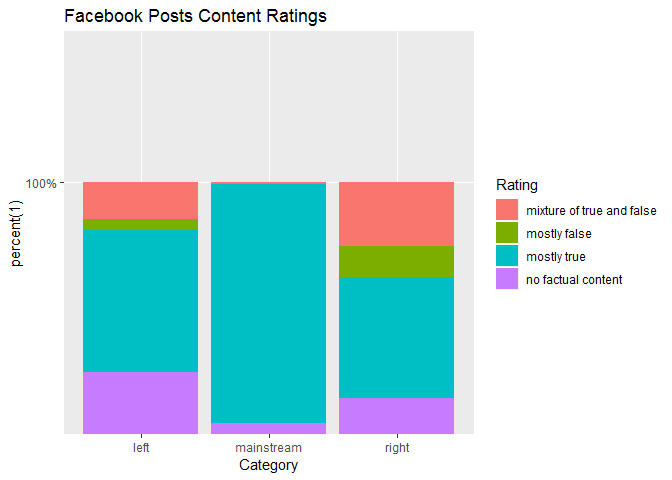
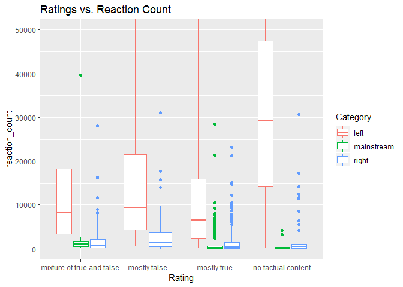
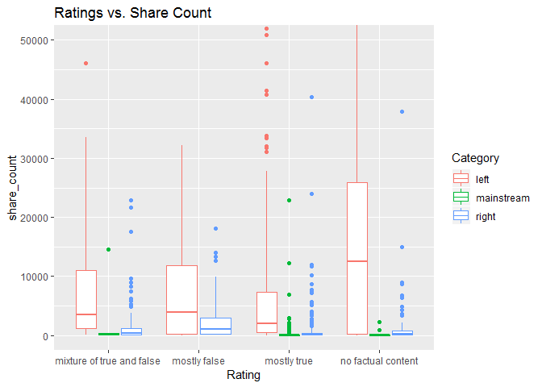
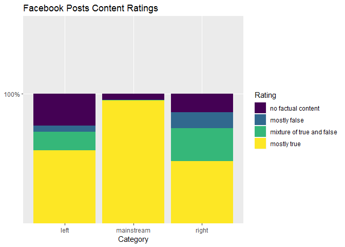
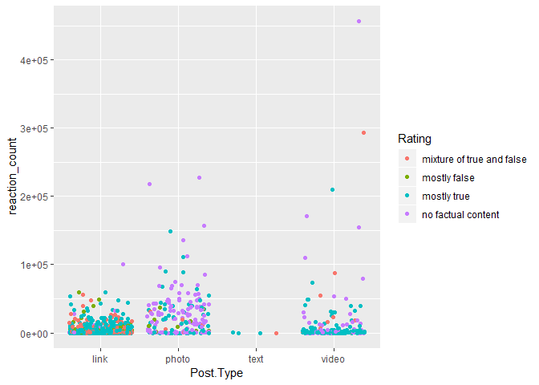

facebook\_factcheck
================

R Markdown
----------

This is an R Markdown document. Markdown is a simple formatting syntax for authoring HTML, PDF, and MS Word documents. For more details on using R Markdown see <http://rmarkdown.rstudio.com>.

When you click the **Knit** button a document will be generated that includes both content as well as the output of any embedded R code chunks within the document. You can embed an R code chunk like this:

need to write a proposal covering these questions: What is the problem you want to solve?

Who is your client and why do they care about this problem? In other words, what will your client DO or DECIDE based on your analysis that they wouldn’t have otherwise?

What data are you going to use for this? How will you acquire this data?

In brief, outline your approach to solving this problem (knowing that this might change later).

What are your deliverables? Typically, this would include code, along with a paper and/or a slide deck.

DATA WRANGLING:

The data comes from Kaggle. It was submitted by a journalist from the news site Buzzfeed. The data was not very messy. I did have to rename some features. Account id, post id, and the post url were integers that were changed to character strings. Date Published was a factor that was changed to a date. There were a few NAs that had to be changed in the columns share count, reaction count, and the comment count. We changed the NAs to the median instead of the mean, because the outliers of all these columns caused each of them to be heavily skewed to the right.

Possible questions:

How do left, mainstream, and right categories of Facebook pages differ in the stories they share?

Which types of stories receive the most engagement from their Facebook followers? Are videos or links more effective for engagement?

Can you replicate BuzzFeed’s findings that “the least accurate pages generated some of the highest numbers of shares, reactions, and comments on Facebook”?

``` r
library(dplyr)
```

    ## Warning: package 'dplyr' was built under R version 3.4.4

    ## 
    ## Attaching package: 'dplyr'

    ## The following objects are masked from 'package:stats':
    ## 
    ##     filter, lag

    ## The following objects are masked from 'package:base':
    ## 
    ##     intersect, setdiff, setequal, union

``` r
library(tidyr)
```

    ## Warning: package 'tidyr' was built under R version 3.4.4

``` r
library(readr)
```

    ## Warning: package 'readr' was built under R version 3.4.4

``` r
library(ggplot2)
```

    ## Warning: package 'ggplot2' was built under R version 3.4.4

``` r
fb<-read.csv("file:///C:/Users/John/Documents/R/fact-checking-facebook-politics-pages/facebook-fact-check.csv")

summary(fb)
```

    ##    account_id           post_id                Category   
    ##  Min.   :6.232e+10   Min.   :5.511e+14   left      : 471  
    ##  1st Qu.:1.145e+14   1st Qu.:1.247e+15   mainstream:1145  
    ##  Median :1.841e+14   Median :1.291e+15   right     : 666  
    ##  Mean   :1.867e+14   Mean   :3.300e+15                    
    ##  3rd Qu.:3.469e+14   3rd Qu.:1.541e+15                    
    ##  Max.   :4.401e+14   Max.   :1.015e+16                    
    ##                                                           
    ##                 Page    
    ##  Politico         :536  
    ##  CNN Politics     :409  
    ##  Eagle Rising     :286  
    ##  Right Wing News  :268  
    ##  Occupy Democrats :209  
    ##  ABC News Politics:200  
    ##  (Other)          :374  
    ##                                                             Post.URL   
    ##  https://www.facebook.com/ABCNewsPolitics/posts/1035057923259100:   1  
    ##  https://www.facebook.com/ABCNewsPolitics/posts/1035269309904628:   1  
    ##  https://www.facebook.com/ABCNewsPolitics/posts/1035305953234297:   1  
    ##  https://www.facebook.com/ABCNewsPolitics/posts/1035322636565962:   1  
    ##  https://www.facebook.com/ABCNewsPolitics/posts/1035352946562931:   1  
    ##  https://www.facebook.com/ABCNewsPolitics/posts/1035366579894901:   1  
    ##  (Other)                                                        :2276  
    ##     Date.Published Post.Type                          Rating    
    ##  2016-09-19:306    link :1780   mixture of true and false: 245  
    ##  2016-09-20:317    photo: 207   mostly false             : 104  
    ##  2016-09-21:306    text :   4   mostly true              :1669  
    ##  2016-09-22:293    video: 291   no factual content       : 264  
    ##  2016-09-23:294                                                 
    ##  2016-09-26:403                                                 
    ##  2016-09-27:363                                                 
    ##  Debate      share_count      reaction_count     comment_count     
    ##     :1984   Min.   :      1   Min.   :     2.0   Min.   :     0.0  
    ##  yes: 298   1st Qu.:     24   1st Qu.:   149.0   1st Qu.:    37.0  
    ##             Median :     96   Median :   545.5   Median :   131.5  
    ##             Mean   :   4045   Mean   :  5364.3   Mean   :   516.1  
    ##             3rd Qu.:    739   3rd Qu.:  2416.8   3rd Qu.:   390.2  
    ##             Max.   :1088995   Max.   :456458.0   Max.   :159047.0  
    ##             NA's   :70        NA's   :2          NA's   :2

``` r
#check which types of stories recieved more engagement
table(fb$Post.Type)
```

    ## 
    ##  link photo  text video 
    ##  1780   207     4   291

``` r
table(fb$Rating)
```

    ## 
    ## mixture of true and false              mostly false 
    ##                       245                       104 
    ##               mostly true        no factual content 
    ##                      1669                       264

Including Plots
---------------

You can also embed plots, for example:

``` r
#Renameing features
fb$account_id <- as.character(fb$account_id)
fb$post_id <- as.character(fb$post_id)
fb$Post.URL <- as.character(fb$Post.URL)
fb$Date.Published <- as.Date(fb$Date.Published)

#correcting na
fb[which(is.na(fb$share_count)),"share_count"]<- 87
fb[which(is.na(fb$reaction_count)),"reaction_count"]<- 543
fb[which(is.na(fb$comment_count)),"comment_count"]<- 131


ggplot(fb,aes(x=Category, fill= Rating))+
  geom_bar()
```



``` r
Total_count<- (fb$share_count+ fb$reaction_count+fb$comment_count)

ggplot(fb, aes(x=Rating,y= reaction_count,color= Category))+
  geom_boxplot(coef=3)
```



``` r
ggplot(fb, aes(x=Date.Published, y= Total_count))+
  geom_point()
```



``` r
summary(fb)
```

    ##   account_id          post_id                Category   
    ##  Length:2282        Length:2282        left      : 471  
    ##  Class :character   Class :character   mainstream:1145  
    ##  Mode  :character   Mode  :character   right     : 666  
    ##                                                         
    ##                                                         
    ##                                                         
    ##                                                         
    ##                 Page       Post.URL         Date.Published      
    ##  Politico         :536   Length:2282        Min.   :2016-09-19  
    ##  CNN Politics     :409   Class :character   1st Qu.:2016-09-20  
    ##  Eagle Rising     :286   Mode  :character   Median :2016-09-22  
    ##  Right Wing News  :268                      Mean   :2016-09-22  
    ##  Occupy Democrats :209                      3rd Qu.:2016-09-26  
    ##  ABC News Politics:200                      Max.   :2016-09-27  
    ##  (Other)          :374                                          
    ##  Post.Type                          Rating     Debate    
    ##  link :1780   mixture of true and false: 245      :1984  
    ##  photo: 207   mostly false             : 104   yes: 298  
    ##  text :   4   mostly true              :1669             
    ##  video: 291   no factual content       : 264             
    ##                                                          
    ##                                                          
    ##                                                          
    ##   share_count      reaction_count   comment_count     
    ##  Min.   :      1   Min.   :     2   Min.   :     0.0  
    ##  1st Qu.:     25   1st Qu.:   149   1st Qu.:    37.0  
    ##  Median :     87   Median :   543   Median :   131.0  
    ##  Mean   :   3923   Mean   :  5360   Mean   :   515.8  
    ##  3rd Qu.:    680   3rd Qu.:  2414   3rd Qu.:   390.0  
    ##  Max.   :1088995   Max.   :456458   Max.   :159047.0  
    ## 

``` r
str(fb)
```

    ## 'data.frame':    2282 obs. of  12 variables:
    ##  $ account_id    : chr  "184096565021911" "184096565021911" "184096565021911" "184096565021911" ...
    ##  $ post_id       : chr  "1035057923259100" "1035269309904628" "1035305953234297" "1035322636565962" ...
    ##  $ Category      : Factor w/ 3 levels "left","mainstream",..: 2 2 2 2 2 2 2 2 2 2 ...
    ##  $ Page          : Factor w/ 9 levels "ABC News Politics",..: 1 1 1 1 1 1 1 1 1 1 ...
    ##  $ Post.URL      : chr  "https://www.facebook.com/ABCNewsPolitics/posts/1035057923259100" "https://www.facebook.com/ABCNewsPolitics/posts/1035269309904628" "https://www.facebook.com/ABCNewsPolitics/posts/1035305953234297" "https://www.facebook.com/ABCNewsPolitics/posts/1035322636565962" ...
    ##  $ Date.Published: Date, format: "2016-09-19" "2016-09-19" ...
    ##  $ Post.Type     : Factor w/ 4 levels "link","photo",..: 4 1 1 1 4 1 4 1 1 4 ...
    ##  $ Rating        : Factor w/ 4 levels "mixture of true and false",..: 4 3 3 3 3 3 3 3 3 3 ...
    ##  $ Debate        : Factor w/ 2 levels "","yes": 1 1 1 1 1 1 1 1 1 1 ...
    ##  $ share_count   : num  87 1 34 35 568 23 46 7 7 152 ...
    ##  $ reaction_count: num  146 33 63 170 3188 ...
    ##  $ comment_count : num  15 34 27 86 2815 ...

``` r
#View(fb)
```

``` r
ggplot(fb, aes(x=Page,fill= Rating))+
  geom_bar()+
  coord_flip()
```



``` r
ggplot(fb,aes(x=Post.Type,y= reaction_count, col=Rating))+
  geom_point()
```



Note that the `echo = FALSE` parameter was added to the code chunk to prevent printing of the R code that generated the plot.
