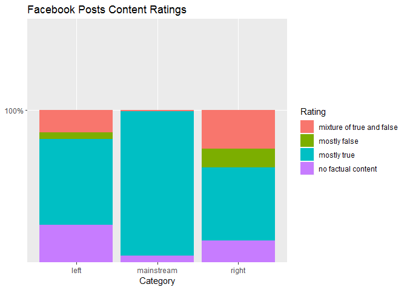
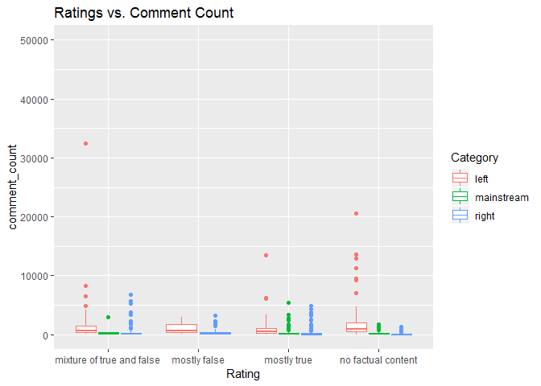
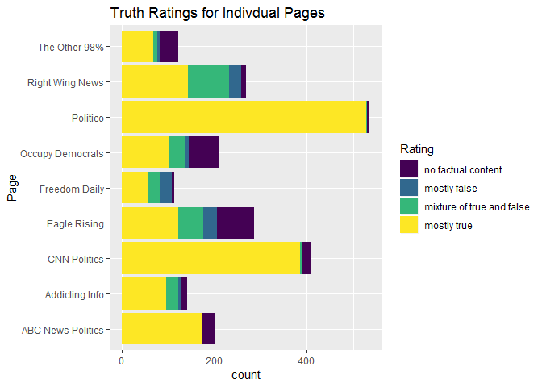
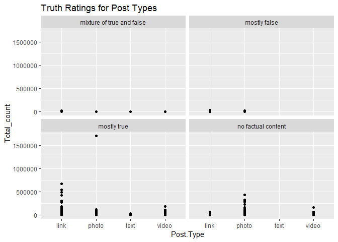

False and Misleading Information on Hyperpartisan Facebook Pages
================

The social media world is becoming more and more polarized. One of the early glimpses of this was the 2016 elections. There is a strong element of disinformation throughout social media. This project is based on research done by Buzzzfeed on Facebook leading up to the 2016 presidential elections. The data was acquired over seven week days (September 19 through 23rd and September 26th and 27th, 2016.) The research included 1145 posts from mainstream political pages (Politico, CNN, ABC), 666 from right-wing political pages (Freedom Daily, Eagle Rising, Right Wing News), 471 from left-wing pages (The Other 98%, Addicting Info, Occupy Democrats ). The pages were ranked based on: • “Mostly True: The post and any related link or image are based on factual information and portray it accurately. This lets them interpret the event/info in their own way, so long as they do not misrepresent events, numbers, quotes, reactions, etc., or make information up. This rating does not allow for unsupported speculation or claims.

• “Mixture of True and False: Some elements of the information are factually accurate, but some elements or claims are not. This rating should be used when speculation or unfounded claims are mixed with real events, numbers, quotes, etc., or when the headline of the link being shared makes a false claim but the text of the story is largely accurate. It should also only be used when the unsupported or false information is roughly equal to the accurate information in the post or link. Finally, use this rating for news articles that are based on unconfirmed information.

• “Mostly False: Most or all of the information in the post or in the link being shared is inaccurate. This should also be used when the central claim being made is false.

• “No Factual Content: This rating is used for posts that are pure opinion, comics, satire, or any other posts that do not make a factual claim. This is also the category to use for posts that are of the “Like this if you think...” variety.

DATA SOURCE:

All nine pages have earned the verified blue checkmark from Facebook. The additional data gathered was Facebook engagement numbers (shares, comments, and reactions). Each posts was noted whether it was a link, photo, video, or text The data comes from Kaggle( <https://www.kaggle.com/mrisdal/fact-checking-facebook-politics-pages>.) It was submitted by a journalists from the news site Buzzfeed News and the original story was ( “Hyperpartisan Facebook Pages Are Publishing False And Misleading Information At An Alarming Rate” )

DATA WRANGLING:

The data was not very messy. I did have to rename some features. Account id, post id, and the post url were integers that were changed to character strings. Date Published was a factor that was changed to a date. There were a few NAs that had to be changed in the columns share count, reaction count, and the comment count. The NAs were changed to the median instead of the mean, because the outliers of all of these columns caused each of them to be heavily skewed to the right.

``` r
library(dplyr)
```

    ## Warning: package 'dplyr' was built under R version 3.4.4

    ## 
    ## Attaching package: 'dplyr'

    ## The following objects are masked from 'package:stats':
    ## 
    ##     filter, lag

    ## The following objects are masked from 'package:base':
    ## 
    ##     intersect, setdiff, setequal, union

``` r
library(tidyr)
```

    ## Warning: package 'tidyr' was built under R version 3.4.4

``` r
library(readr)
```

    ## Warning: package 'readr' was built under R version 3.4.4

``` r
library(ggplot2)
```

    ## Warning: package 'ggplot2' was built under R version 3.4.4

``` r
library(scales)
```

    ## Warning: package 'scales' was built under R version 3.4.4

    ## 
    ## Attaching package: 'scales'

    ## The following object is masked from 'package:readr':
    ## 
    ##     col_factor

``` r
#library(RWeka)

fb<-read.csv("file:///C:/Users/John/Documents/R/fact-checking-facebook-politics-pages/facebook-fact-check.csv")

summary(fb)
```

    ##    account_id           post_id                Category   
    ##  Min.   :6.232e+10   Min.   :5.511e+14   left      : 471  
    ##  1st Qu.:1.145e+14   1st Qu.:1.247e+15   mainstream:1145  
    ##  Median :1.841e+14   Median :1.291e+15   right     : 666  
    ##  Mean   :1.867e+14   Mean   :3.300e+15                    
    ##  3rd Qu.:3.469e+14   3rd Qu.:1.541e+15                    
    ##  Max.   :4.401e+14   Max.   :1.015e+16                    
    ##                                                           
    ##                 Page    
    ##  Politico         :536  
    ##  CNN Politics     :409  
    ##  Eagle Rising     :286  
    ##  Right Wing News  :268  
    ##  Occupy Democrats :209  
    ##  ABC News Politics:200  
    ##  (Other)          :374  
    ##                                                             Post.URL   
    ##  https://www.facebook.com/ABCNewsPolitics/posts/1035057923259100:   1  
    ##  https://www.facebook.com/ABCNewsPolitics/posts/1035269309904628:   1  
    ##  https://www.facebook.com/ABCNewsPolitics/posts/1035305953234297:   1  
    ##  https://www.facebook.com/ABCNewsPolitics/posts/1035322636565962:   1  
    ##  https://www.facebook.com/ABCNewsPolitics/posts/1035352946562931:   1  
    ##  https://www.facebook.com/ABCNewsPolitics/posts/1035366579894901:   1  
    ##  (Other)                                                        :2276  
    ##     Date.Published Post.Type                          Rating    
    ##  2016-09-19:306    link :1780   mixture of true and false: 245  
    ##  2016-09-20:317    photo: 207   mostly false             : 104  
    ##  2016-09-21:306    text :   4   mostly true              :1669  
    ##  2016-09-22:293    video: 291   no factual content       : 264  
    ##  2016-09-23:294                                                 
    ##  2016-09-26:403                                                 
    ##  2016-09-27:363                                                 
    ##  Debate      share_count      reaction_count     comment_count     
    ##     :1984   Min.   :      1   Min.   :     2.0   Min.   :     0.0  
    ##  yes: 298   1st Qu.:     24   1st Qu.:   149.0   1st Qu.:    37.0  
    ##             Median :     96   Median :   545.5   Median :   131.5  
    ##             Mean   :   4045   Mean   :  5364.3   Mean   :   516.1  
    ##             3rd Qu.:    739   3rd Qu.:  2416.8   3rd Qu.:   390.2  
    ##             Max.   :1088995   Max.   :456458.0   Max.   :159047.0  
    ##             NA's   :70        NA's   :2          NA's   :2

``` r
#check which types of stories recieved more engagement
table(fb$Post.Type)
```

    ## 
    ##  link photo  text video 
    ##  1780   207     4   291

``` r
table(fb$Rating)
```

    ## 
    ## mixture of true and false              mostly false 
    ##                       245                       104 
    ##               mostly true        no factual content 
    ##                      1669                       264

``` r
#Renameing features
fb$account_id <- as.character(fb$account_id)
fb$post_id <- as.character(fb$post_id)
fb$Post.URL <- as.character(fb$Post.URL)
fb$Date.Published <- as.Date(fb$Date.Published)

#correcting na
fb[which(is.na(fb$share_count)),"share_count"]<- 87
fb[which(is.na(fb$reaction_count)),"reaction_count"]<- 543
fb[which(is.na(fb$comment_count)),"comment_count"]<- 131


ggplot(fb,aes(x=Category,y = percent(1), fill= Rating))+
   geom_bar(position = "fill",stat = "identity") +
  ggtitle( "Facebook Posts Content Ratings")
```



``` r
Total_count<- (fb$share_count+ fb$reaction_count+fb$comment_count)

ggplot(fb,aes(x=Rating,y= reaction_count,color= Category))+
  geom_boxplot(coef=3, fun = median)+
  coord_cartesian(ylim=c(0,50000))+
  ggtitle("Ratings vs. Reaction Count")
```

    ## Warning: Ignoring unknown parameters: fun


``` r
ggplot(fb,aes(x=Rating,y= share_count,color= Category))+
  geom_boxplot(coef=3, fun = median)+
  coord_cartesian(ylim=c(0,50000))+
  ggtitle("Ratings vs. Share Count")
```

    ## Warning: Ignoring unknown parameters: fun


``` r
ggplot(fb,aes(x=Rating,y= comment_count,color= Category))+
  geom_boxplot(coef=3, fun = median)+
  coord_cartesian(ylim=c(0,50000))+
  ggtitle("Ratings vs. Comment Count")
```

    ## Warning: Ignoring unknown parameters: fun



``` r
ggplot(fb, aes(x=Date.Published, y= Total_count))+
  geom_point()+
  ggtitle("Total Counts on Posted Dates")
```


``` r
summary(fb)
```

    ##   account_id          post_id                Category   
    ##  Length:2282        Length:2282        left      : 471  
    ##  Class :character   Class :character   mainstream:1145  
    ##  Mode  :character   Mode  :character   right     : 666  
    ##                                                         
    ##                                                         
    ##                                                         
    ##                                                         
    ##                 Page       Post.URL         Date.Published      
    ##  Politico         :536   Length:2282        Min.   :2016-09-19  
    ##  CNN Politics     :409   Class :character   1st Qu.:2016-09-20  
    ##  Eagle Rising     :286   Mode  :character   Median :2016-09-22  
    ##  Right Wing News  :268                      Mean   :2016-09-22  
    ##  Occupy Democrats :209                      3rd Qu.:2016-09-26  
    ##  ABC News Politics:200                      Max.   :2016-09-27  
    ##  (Other)          :374                                          
    ##  Post.Type                          Rating     Debate    
    ##  link :1780   mixture of true and false: 245      :1984  
    ##  photo: 207   mostly false             : 104   yes: 298  
    ##  text :   4   mostly true              :1669             
    ##  video: 291   no factual content       : 264             
    ##                                                          
    ##                                                          
    ##                                                          
    ##   share_count      reaction_count   comment_count     
    ##  Min.   :      1   Min.   :     2   Min.   :     0.0  
    ##  1st Qu.:     25   1st Qu.:   149   1st Qu.:    37.0  
    ##  Median :     87   Median :   543   Median :   131.0  
    ##  Mean   :   3923   Mean   :  5360   Mean   :   515.8  
    ##  3rd Qu.:    680   3rd Qu.:  2414   3rd Qu.:   390.0  
    ##  Max.   :1088995   Max.   :456458   Max.   :159047.0  
    ## 

``` r
str(fb)
```

    ## 'data.frame':    2282 obs. of  12 variables:
    ##  $ account_id    : chr  "184096565021911" "184096565021911" "184096565021911" "184096565021911" ...
    ##  $ post_id       : chr  "1035057923259100" "1035269309904628" "1035305953234297" "1035322636565962" ...
    ##  $ Category      : Factor w/ 3 levels "left","mainstream",..: 2 2 2 2 2 2 2 2 2 2 ...
    ##  $ Page          : Factor w/ 9 levels "ABC News Politics",..: 1 1 1 1 1 1 1 1 1 1 ...
    ##  $ Post.URL      : chr  "https://www.facebook.com/ABCNewsPolitics/posts/1035057923259100" "https://www.facebook.com/ABCNewsPolitics/posts/1035269309904628" "https://www.facebook.com/ABCNewsPolitics/posts/1035305953234297" "https://www.facebook.com/ABCNewsPolitics/posts/1035322636565962" ...
    ##  $ Date.Published: Date, format: "2016-09-19" "2016-09-19" ...
    ##  $ Post.Type     : Factor w/ 4 levels "link","photo",..: 4 1 1 1 4 1 4 1 1 4 ...
    ##  $ Rating        : Factor w/ 4 levels "mixture of true and false",..: 4 3 3 3 3 3 3 3 3 3 ...
    ##  $ Debate        : Factor w/ 2 levels "","yes": 1 1 1 1 1 1 1 1 1 1 ...
    ##  $ share_count   : num  87 1 34 35 568 23 46 7 7 152 ...
    ##  $ reaction_count: num  146 33 63 170 3188 ...
    ##  $ comment_count : num  15 34 27 86 2815 ...

``` r
#View(fb)
```

``` r
ggplot(fb, aes(x=Page,fill= Rating))+
  guides(fill=FALSE)+
  geom_bar()+
  coord_flip()+
  ggtitle("Truth Ratings for Indivdual Pages")
```


``` r
ggplot(fb,aes(x=Post.Type,y= reaction_count, col=Rating))+
  geom_point(position = "jitter")+
  ggtitle("Truth Ratings Based on Post Type")
```



``` r
ggplot(data=fb)+
  geom_point(mapping= aes(x=Post.Type, y= Total_count, position= "dodge"))+
  facet_wrap( ~ Rating,nrow = 2)+
  ggtitle("Truth Ratings for Post Types")
```

    ## Warning: Ignoring unknown aesthetics: position



``` r
ggplot(fb,aes(x=Rating, group=Page))+
  geom_bar(aes(y = ..prop.., fill = factor(..x..)), stat="count") +
    geom_text(aes( label = scales::percent(..prop..),
                   y= ..prop.. ), stat= "count", vjust = -.5) +
    labs(y = "Percent", fill="Rating") +
    facet_grid(~Page) +
    scale_y_continuous(labels = scales::percent)+
  coord_flip()+
  guides(fill=FALSE)+
  ggtitle("Percent of Truth Ratings Based on Pages")
```


``` r
ggplot(fb,aes(x=Rating, group=Category))+
  geom_bar(aes(y = ..prop.., fill = factor(..x..)), stat="count") +
    geom_text(aes( label = scales::percent(..prop..),
                   y= ..prop.. ), stat= "count", vjust = -.5) +
    labs(y = "Percent", fill="Rating") +
    facet_grid(~Category) +
    scale_y_continuous(labels = scales::percent)+
  coord_flip()+
  guides(fill=FALSE)+
  ggtitle("Percent of Truth Ratings Based on Partisain Leaning")
```


``` r
ggplot(fb, aes(Date.Published, group = Category)) + 
          geom_bar(aes(y = ..prop..), stat="count") + 
          scale_y_continuous(labels=scales::percent) +
          ylab("relative frequencies") +
          facet_grid(Category~.)+
  ggtitle("Activity of Posts")
```


``` r
ggplot(fb)+
  geom_point(mapping = aes(x= reaction_count,y= Total_count))+
  facet_grid(.~Rating)+
  xlim(0,50000)+
  ylim(0,50000)+
  labs(x="")+
  ggtitle("Reactions of the pages Based On Truth")
```

    ## Warning: Removed 128 rows containing missing values (geom_point).


Note that the `echo = FALSE` parameter was added to the code chunk to prevent printing of the R code that generated the plot.
