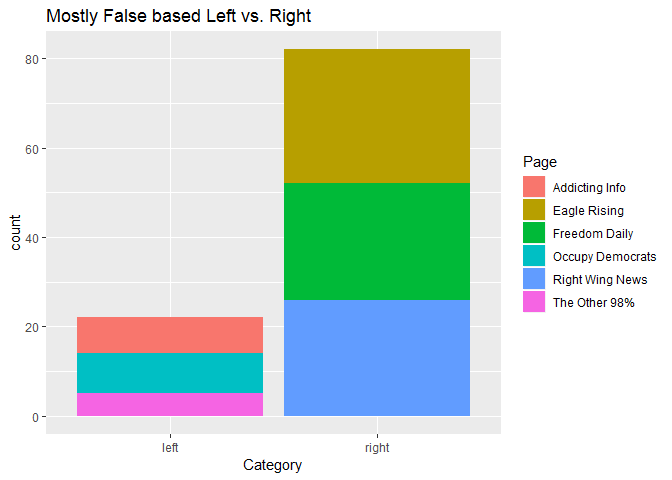
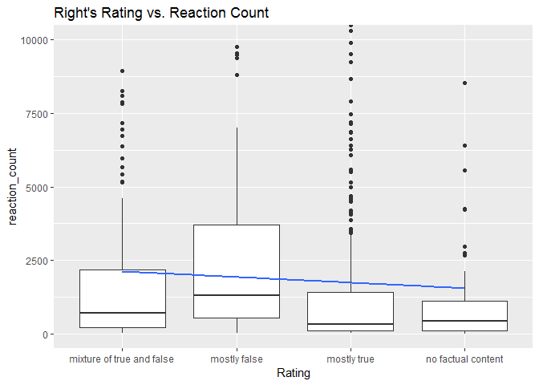
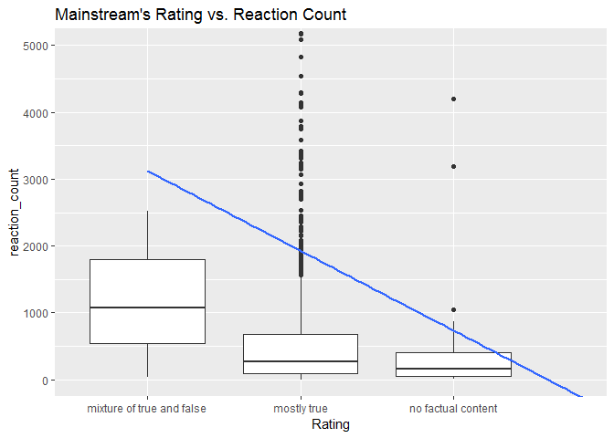
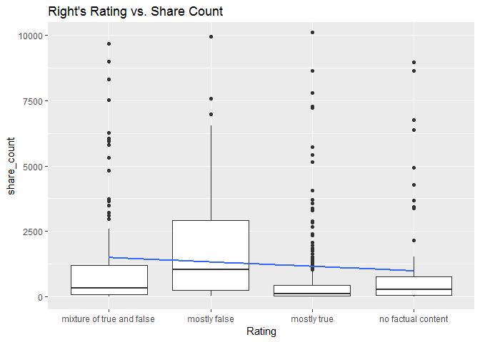
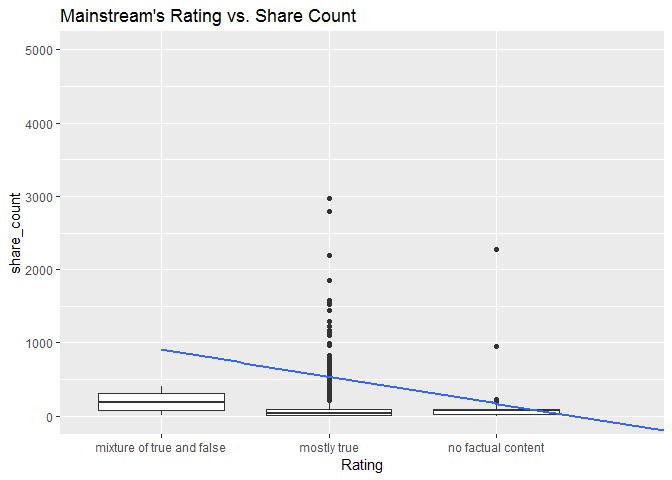

False and Misleading Information on Hyperpartisan Facebook Pages
================

The social media world is becoming more and more polarized. One of the early glimpses of this was the 2016 elections. There is a strong element of disinformation throughout social media. This project is based on research done by Buzzzfeed on Facebook leading up to the 2016 presidential elections. The data was acquired over seven week days (September 19 through 23rd and September 26th and 27th, 2016) The research included 1145 posts from mainstream political pages (Politico, CNN, ABC), 666 from right-wing political pages (Freedom Daily, Eagle Rising, Right Wing News), 471 from left-wing pages (The Other 98%, Addicting Info, Occupy Democrats ). The pages were ranked based on:

• “Mostly True: The post and any related link or image are based on factual information and portray it accurately. This lets them interpret the event/info in their own way, so long as they do not misrepresent events, numbers, quotes, reactions, etc., or make information up. This rating does not allow for unsupported speculation or claims.

• “Mixture of True and False: Some elements of the information are factually accurate, but some elements or claims are not. This rating should be used when speculation or unfounded claims are mixed with real events, numbers, quotes, etc., or when the headline of the link being shared makes a false claim but the text of the story is largely accurate. It should also only be used when the unsupported or false information is roughly equal to the accurate information in the post or link. Finally, use this rating for news articles that are based on unconfirmed information.

• “Mostly False: Most or all of the information in the post or in the link being shared is inaccurate. This should also be used when the central claim being made is false.

• “No Factual Content: This rating is used for posts that are pure opinion, comics, satire, or any other posts that do not make a factual claim. This is also the category to use for posts that are of the “Like this if you think...” variety.

DATA SOURCE:

All nine pages have earned the verified blue checkmark from Facebook. The additional data gathered was Facebook engagement numbers (shares, comments, and reactions). Each posts was noted whether it was a link, photo, video, or text The data comes from Kaggle( <https://www.kaggle.com/mrisdal/fact-checking-facebook-politics-pages>.) It was submitted by a journalists from the news site Buzzfeed News and the original story was ( “Hyperpartisan Facebook Pages Are Publishing False And Misleading Information At An Alarming Rate” )

``` r
library(digest)
```

    ## Warning: package 'digest' was built under R version 3.4.4

``` r
library(dplyr)
```

    ## Warning: package 'dplyr' was built under R version 3.4.4

    ## 
    ## Attaching package: 'dplyr'

    ## The following objects are masked from 'package:stats':
    ## 
    ##     filter, lag

    ## The following objects are masked from 'package:base':
    ## 
    ##     intersect, setdiff, setequal, union

``` r
library(tidyr)
```

    ## Warning: package 'tidyr' was built under R version 3.4.4

``` r
library(readr)
```

    ## Warning: package 'readr' was built under R version 3.4.4

``` r
library(ggplot2)
```

    ## Warning: package 'ggplot2' was built under R version 3.4.4

``` r
library(scales)
```

    ## Warning: package 'scales' was built under R version 3.4.4

    ## 
    ## Attaching package: 'scales'

    ## The following object is masked from 'package:readr':
    ## 
    ##     col_factor

``` r
library(gmodels)
```

    ## Warning: package 'gmodels' was built under R version 3.4.4

``` r
fb<-read.csv("file:///C:/Users/John/Documents/R/fact-checking-facebook-politics-pages/facebook-fact-check.csv")
```

DATA WRANGLING:

The data was not very messy. I did have to rename some features. Account id, post id, and the post url were integers that were changed to character strings. Date Published was a factor that was changed to a date. There were a few NAs that had to be changed in the columns share count, reaction count, and the comment count. The NAs were changed to the median instead of the mean, because the outliers of all of these columns caused each of them to be heavily skewed to the right. New assignments for variables were created for visualization designs. Order changes are for creating trendlines for certain features.

``` r
#Renameing features
fb$account_id <- as.character(fb$account_id)
fb$post_id <- as.character(fb$post_id)
fb$Post.URL <- as.character(fb$Post.URL)
fb$Date.Published <- as.Date(fb$Date.Published)

#correcting na
fb[which(is.na(fb$share_count)),"share_count"]<- 87
fb[which(is.na(fb$reaction_count)),"reaction_count"]<- 543
fb[which(is.na(fb$comment_count)),"comment_count"]<- 131

#assigning variables
Total_count<- (fb$share_count+ fb$reaction_count+fb$comment_count)

fals_tags<-fb[fb$Rating=="mostly false",]
tru_tags<-fb[fb$Rating=="mostly true",]
mix_tags<-fb[fb$Rating==" mixture of true and false",]
no_tags<-fb[fb$Rating=="no factual content",]

Acount<-fb[fb$Page == "Addicting info",]
left<- fb[fb$Category=="left",]
mainsteam<-fb[fb$Category=="mainstream",]
right<- fb[fb$Category=="right",]

#order changes
fb$Rating <- factor(fb$Rating, levels = c("no factual content", "mostly false", "mixture of true and false" , "mostly true") , ordered = TRUE)
fb$Category<- factor(fb$Category, levels = c("left","mainstream","right"),ordered = TRUE)
```

The Facebook data was initially acquired to find out the source or sources of the false news that was becoming mainstream news at that time. Some of the more interesting points were where the false news was coming from, the medium that was used, and what kinds of posts got the most reactions.

``` r
summary(fb)
```

    ##   account_id          post_id                Category   
    ##  Length:2282        Length:2282        left      : 471  
    ##  Class :character   Class :character   mainstream:1145  
    ##  Mode  :character   Mode  :character   right     : 666  
    ##                                                         
    ##                                                         
    ##                                                         
    ##                                                         
    ##                 Page       Post.URL         Date.Published      
    ##  Politico         :536   Length:2282        Min.   :2016-09-19  
    ##  CNN Politics     :409   Class :character   1st Qu.:2016-09-20  
    ##  Eagle Rising     :286   Mode  :character   Median :2016-09-22  
    ##  Right Wing News  :268                      Mean   :2016-09-22  
    ##  Occupy Democrats :209                      3rd Qu.:2016-09-26  
    ##  ABC News Politics:200                      Max.   :2016-09-27  
    ##  (Other)          :374                                          
    ##  Post.Type                          Rating     Debate    
    ##  link :1780   no factual content       : 264      :1984  
    ##  photo: 207   mostly false             : 104   yes: 298  
    ##  text :   4   mixture of true and false: 245             
    ##  video: 291   mostly true              :1669             
    ##                                                          
    ##                                                          
    ##                                                          
    ##   share_count      reaction_count   comment_count     
    ##  Min.   :      1   Min.   :     2   Min.   :     0.0  
    ##  1st Qu.:     25   1st Qu.:   149   1st Qu.:    37.0  
    ##  Median :     87   Median :   543   Median :   131.0  
    ##  Mean   :   3923   Mean   :  5360   Mean   :   515.8  
    ##  3rd Qu.:    680   3rd Qu.:  2414   3rd Qu.:   390.0  
    ##  Max.   :1088995   Max.   :456458   Max.   :159047.0  
    ## 

The summary give an excellent break down of the amount reactions that seven days of posts created for just nine Facebbooks pages. All of the counts were heavily left skewed.

``` r
#check which types of stories recieved more engagement
table(fb$Post.Type)
```

    ## 
    ##  link photo  text video 
    ##  1780   207     4   291

``` r
table(fb$Rating)
```

    ## 
    ##        no factual content              mostly false 
    ##                       264                       104 
    ## mixture of true and false               mostly true 
    ##                       245                      1669

``` r
 #Proportions

post_table<-table(fb$Post.Type,dnn = "Percentage Proportions")
post_pcrt<- prop.table(post_table)*100
round(post_pcrt,digits = 1)
```

    ## Percentage Proportions
    ##  link photo  text video 
    ##  78.0   9.1   0.2  12.8

``` r
rating_table<-table(fb$Rating,dnn = "Percentage Proportions")
rating_pcrt<- prop.table(rating_table)*100
round(rating_pcrt,digits = 1)
```

    ## Percentage Proportions
    ##        no factual content              mostly false 
    ##                      11.6                       4.6 
    ## mixture of true and false               mostly true 
    ##                      10.7                      73.1

``` r
CrossTable(x=fb$Category,y=fb$Rating,chisq = TRUE)
```

    ## 
    ##  
    ##    Cell Contents
    ## |-------------------------|
    ## |                       N |
    ## | Chi-square contribution |
    ## |           N / Row Total |
    ## |           N / Col Total |
    ## |         N / Table Total |
    ## |-------------------------|
    ## 
    ##  
    ## Total Observations in Table:  2282 
    ## 
    ##  
    ##              | fb$Rating 
    ##  fb$Category |        no factual content |              mostly false | mixture of true and false |               mostly true |                 Row Total | 
    ## -------------|---------------------------|---------------------------|---------------------------|---------------------------|---------------------------|
    ##         left |                       116 |                        22 |                        68 |                       265 |                       471 | 
    ##              |                    69.438 |                     0.013 |                     6.010 |                    18.337 |                           | 
    ##              |                     0.246 |                     0.047 |                     0.144 |                     0.563 |                     0.206 | 
    ##              |                     0.439 |                     0.212 |                     0.278 |                     0.159 |                           | 
    ##              |                     0.051 |                     0.010 |                     0.030 |                     0.116 |                           | 
    ## -------------|---------------------------|---------------------------|---------------------------|---------------------------|---------------------------|
    ##   mainstream |                        52 |                         0 |                         8 |                      1085 |                      1145 | 
    ##              |                    48.876 |                    52.182 |                   107.450 |                    73.192 |                           | 
    ##              |                     0.045 |                     0.000 |                     0.007 |                     0.948 |                     0.502 | 
    ##              |                     0.197 |                     0.000 |                     0.033 |                     0.650 |                           | 
    ##              |                     0.023 |                     0.000 |                     0.004 |                     0.475 |                           | 
    ## -------------|---------------------------|---------------------------|---------------------------|---------------------------|---------------------------|
    ##        right |                        96 |                        82 |                       169 |                       319 |                       666 | 
    ##              |                     4.662 |                    87.884 |                   132.940 |                    58.010 |                           | 
    ##              |                     0.144 |                     0.123 |                     0.254 |                     0.479 |                     0.292 | 
    ##              |                     0.364 |                     0.788 |                     0.690 |                     0.191 |                           | 
    ##              |                     0.042 |                     0.036 |                     0.074 |                     0.140 |                           | 
    ## -------------|---------------------------|---------------------------|---------------------------|---------------------------|---------------------------|
    ## Column Total |                       264 |                       104 |                       245 |                      1669 |                      2282 | 
    ##              |                     0.116 |                     0.046 |                     0.107 |                     0.731 |                           | 
    ## -------------|---------------------------|---------------------------|---------------------------|---------------------------|---------------------------|
    ## 
    ##  
    ## Statistics for All Table Factors
    ## 
    ## 
    ## Pearson's Chi-squared test 
    ## ------------------------------------------------------------
    ## Chi^2 =  658.9946     d.f. =  6     p =  4.349534e-139 
    ## 
    ## 
    ## 

``` r
CrossTable(x=fb$Rating,y=fb$Post.Type,chisq = TRUE)
```

    ## Warning in chisq.test(t, correct = FALSE, ...): Chi-squared approximation
    ## may be incorrect

    ## 
    ##  
    ##    Cell Contents
    ## |-------------------------|
    ## |                       N |
    ## | Chi-square contribution |
    ## |           N / Row Total |
    ## |           N / Col Total |
    ## |         N / Table Total |
    ## |-------------------------|
    ## 
    ##  
    ## Total Observations in Table:  2282 
    ## 
    ##  
    ##                           | fb$Post.Type 
    ##                 fb$Rating |      link |     photo |      text |     video | Row Total | 
    ## --------------------------|-----------|-----------|-----------|-----------|-----------|
    ##        no factual content |        71 |       129 |         0 |        64 |       264 | 
    ##                           |    88.404 |   460.845 |     0.463 |    27.334 |           | 
    ##                           |     0.269 |     0.489 |     0.000 |     0.242 |     0.116 | 
    ##                           |     0.040 |     0.623 |     0.000 |     0.220 |           | 
    ##                           |     0.031 |     0.057 |     0.000 |     0.028 |           | 
    ## --------------------------|-----------|-----------|-----------|-----------|-----------|
    ##              mostly false |        95 |         9 |         0 |         0 |       104 | 
    ##                           |     2.374 |     0.020 |     0.182 |    13.262 |           | 
    ##                           |     0.913 |     0.087 |     0.000 |     0.000 |     0.046 | 
    ##                           |     0.053 |     0.043 |     0.000 |     0.000 |           | 
    ##                           |     0.042 |     0.004 |     0.000 |     0.000 |           | 
    ## --------------------------|-----------|-----------|-----------|-----------|-----------|
    ## mixture of true and false |       229 |         6 |         1 |         9 |       245 | 
    ##                           |     7.515 |    11.844 |     0.758 |    15.835 |           | 
    ##                           |     0.935 |     0.024 |     0.004 |     0.037 |     0.107 | 
    ##                           |     0.129 |     0.029 |     0.250 |     0.031 |           | 
    ##                           |     0.100 |     0.003 |     0.000 |     0.004 |           | 
    ## --------------------------|-----------|-----------|-----------|-----------|-----------|
    ##               mostly true |      1385 |        63 |         3 |       218 |      1669 | 
    ##                           |     5.311 |    51.611 |     0.002 |     0.126 |           | 
    ##                           |     0.830 |     0.038 |     0.002 |     0.131 |     0.731 | 
    ##                           |     0.778 |     0.304 |     0.750 |     0.749 |           | 
    ##                           |     0.607 |     0.028 |     0.001 |     0.096 |           | 
    ## --------------------------|-----------|-----------|-----------|-----------|-----------|
    ##              Column Total |      1780 |       207 |         4 |       291 |      2282 | 
    ##                           |     0.780 |     0.091 |     0.002 |     0.128 |           | 
    ## --------------------------|-----------|-----------|-----------|-----------|-----------|
    ## 
    ##  
    ## Statistics for All Table Factors
    ## 
    ## 
    ## Pearson's Chi-squared test 
    ## ------------------------------------------------------------
    ## Chi^2 =  685.8855     d.f. =  9     p =  7.480489e-142 
    ## 
    ## 
    ## 

With such a high chi-squared and a low p-value, we must reject the probabilty of independence of the two variables. For example, there is a high probability that "No factual content" would be a photo.

The false news came from both right-wing and left-wing news sites, where the smallest percentage came from the major mainstream news sites. Mainstream created the majority of the posts, but they also carried the most truth. The total number of posts ranked was 2282, and the ranking of those post were 1669 mostly true, 104 mostly false, 245 mixture of true and false, and 264 posts with no factual content.

``` r
ggplot(fb,aes(x=Category,y = percent(1), fill= Rating))+
   geom_bar(position = "fill",stat = "identity") +
  ggtitle( "Facebook Posts Content Ratings")+
  theme(axis.title.y =element_blank())
```


``` r
ggplot(fb, aes(x=Page,fill= Rating))+
  geom_bar()+
  coord_flip()+
  ggtitle("Truth Ratings for Indivdual Pages")
```


``` r
fals_tags<-fb[fb$Rating=="mostly false",]

ggplot(data = fals_tags)+
 geom_bar(mapping = aes(x = Category, fill = Page))+
  ggtitle("Mostly False based Left vs. Right")
```

 The main stream sites created 1145 posts. With 0.7% ranked as a mixture of true and false, and no post ranked as mostly false. Politico had the highest mixture of true and false at 0.4%, but they also had the highest truth ranking at 98.5%. Politico had the lowest amount of no factual content than any other site. Of the 666 posts created by the right 37.7% were mostly false (25.4%) and a mixture of true and false (12.3%). The site creating the highest number of false posts among all the sites came from Right Wing News with a mostly false at 33.2% and a mixture of true and false at 9.7% of its 286 posts totaling 52.9% of their posts. The left-wing sites created 471 posts of which 19.1% were mostly false (4.7%) and a mixture of true and false (14.7%). The highest number of false left-wing posts were created by Addicting Info with 23.6% of their 141 posts being false (5.7%) and a mixture of true and false (17.9%).

``` r
ggplot(fb,aes(x=Rating, group=Page))+
  geom_bar(aes(y = ..prop.., fill = factor(..x..)), stat="count") +
    geom_text(aes( label = scales::percent(..prop..),
                   y= ..prop.. ), stat= "count", vjust = -.5) +
    labs(y = "Percent", fill="Rating") +
    facet_wrap(~Page, labeller = label_value) +
    scale_y_continuous(labels = scales::percent)+
  coord_flip()+
  ggtitle("Percent of Truth Ratings Based on Pages")+
  theme(axis.ticks = element_blank(), 
        axis.text = element_blank(),
        legend.position="bottom")+
        scale_fill_discrete(labels=c("Mixture of True and False","Mostly False","Mostly True","No Factual Content"))
```


``` r
ggplot(fb,aes(x=Rating, group=Category))+
  geom_bar(aes(y = ..prop.., fill = factor(..x..)), stat="count") +
    geom_text(aes( label = scales::percent(..prop..),
                   y= ..prop.. ), stat= "count", vjust = -.5) +
    labs(y = "Percent", fill="Rating") +
    facet_grid(~Category) +
    scale_y_continuous(labels = scales::percent)+
  coord_flip()+
  ggtitle("Percent of Truth Ratings Based on Partisain Leaning")+
  theme(axis.ticks = element_blank(), 
        axis.text = element_blank(),
 legend.position="bottom")+
        scale_fill_discrete(labels=c("Mixture of True and False","Mostly False","Mostly True","No Factual Content"))
```

 The reaction to the various posts is also interesting. The total count of shares, comments, and reactions (likes, upvotes, and emojis) was 22,361,852. The posts with no factual content received the most reactions (10,160,570) followed by the post that were ranked mostly true (8,235,169), third was mostly false (5,863,038), and last was a mixture of true and false (2,932,433). The links received the most attention with 4,277,061 reactions, 2,161,886 shares, and 551,922 comments. The photos were a close second with 5,196,202 reactions, 3,144,489 shares, and 174,497 comments. The videos received a lot of attention also with 2,758,187 reactions, 3,646,836 shares, and 450,418 comments. Interestingly, the text did not receive nearly as much attention as the rest at 205 reactions, 11 shares, and 138 comments.

``` r
ggplot(fb,aes(x=Rating,y= reaction_count,color= Category))+
  geom_boxplot(coef=3, fun = median)+
  coord_cartesian(ylim=c(0,100000))+
  ggtitle("Ratings vs. Reaction Count")
```

    ## Warning: Ignoring unknown parameters: fun


``` r
ggplot(fb,aes(x=Rating,y= share_count,color= Category))+
  geom_boxplot(coef=3, fun = median)+
  coord_cartesian(ylim=c(0,100000))+
  ggtitle("Ratings vs. Share Count")
```

    ## Warning: Ignoring unknown parameters: fun



``` r
ggplot(fb,aes(x=Rating,y= comment_count,color= Category))+
  geom_boxplot(coef=3, fun = median)+
  coord_cartesian(ylim=c(0,7500))+
  ggtitle("Ratings vs. Comment Count")
```

    ## Warning: Ignoring unknown parameters: fun



The days of the posts did not show any real difference to reactions, comments, or shares. But on September 21, 2016 a video from a the left leaning site "Occupy Democrats" had the most attention with over 1.7 million reactions, comments, and shares.

``` r
ggplot(fb, aes(x=Date.Published, y= Total_count))+
  geom_point()+
  ggtitle("Total Counts on Posted Dates")
```


``` r
fb%>% group_by(Date.Published,Rating) %>% 
summarise(posts=length(Rating)) %>% ggplot(aes(as.Date(Date.Published),posts,col=Rating)) +
geom_line(size=1.5)+geom_point() + xlab("Date") + ylab("Posts") + ggtitle("Number of posts with Time ")
```

    ## Warning: package 'bindrcpp' was built under R version 3.4.4



``` r
fb%>% group_by(Category,Rating) %>% 
summarise(posts=length(Rating)) %>% ggplot(aes(as.numeric(Category),posts,col=Rating)) +
geom_line(size=1.5)+geom_point() + xlab("Date") + ylab("Posts") + ggtitle("Number of posts with Time ")
```



``` r
ggplot(fb, aes(Date.Published, group = Category)) + 
          geom_bar(aes(y = ..prop..), stat="count") + 
          scale_y_continuous(labels=scales::percent) +
          ylab("relative frequencies") +
          facet_grid(Category~.)+
  ggtitle("Activity of Posts")
```


``` r
#ggplot(fb,aes(Rating,col=left))+
 # geom_bar()
```

Here we see that " mostly true" posts made up the majority of the total posts.

``` r
ggplot(fb,aes(x=Post.Type,y= reaction_count, col=Rating))+
  geom_point(position = "jitter")+
  facet_grid(Post.Type ~ Rating)+
  coord_cartesian(ylim=c(0,50000))+
   theme( axis.text.x.bottom = element_blank())+
  ggtitle("Truth Ratings Based on Post Type")
```


``` r
ggplot(data=fb)+
  geom_point(mapping= aes(x=Post.Type, y= Total_count, position= "dodge"))+
  facet_wrap( ~ Rating,nrow = 2)+
  coord_cartesian(ylim=c(0,80000))+
  ggtitle("Truth Ratings for Post Types")
```

    ## Warning: Ignoring unknown aesthetics: position


``` r
ggplot(fb)+
  geom_point(mapping = aes(x= reaction_count,y= Total_count))+
  facet_grid(.~Rating)+
  xlim(0,50000)+
  ylim(0,50000)+
  labs(x="")+
  theme(axis.ticks = element_blank(), 
        axis.text = element_blank())+
  ggtitle("Reactions of the pages Based On Truth")
```

    ## Warning: Removed 141 rows containing missing values (geom_point).


``` r
vals<- c(89.53222,122.31655,11.76975)
val_names<- sprintf("%s(%s)", c("Share Count","Reaction Count"," Comment Count"),scales::percent(round(vals/sum(vals),digits=4)))
names(vals)<-val_names

waffle::waffle(vals, rows=8)+
  ggthemes::scale_fill_tableau(name=NULL)+
  ggtitle("Total Count")+
  labs(x=" 1 square = 100,000")
```

    ## Scale for 'fill' is already present. Adding another scale for 'fill',
    ## which will replace the existing scale.


``` r
ggplot(fb,aes( x= Post.Type,y=Total_count, fill=Category))+
  geom_col()+
  facet_grid(Post.Type ~ Rating)+
  coord_cartesian(ylim=c(0,50000))+
   theme( axis.text.x.bottom = element_blank())+
  ggtitle("Truth Ratings Based on Post Type")
```


From these graphs we see very little reactions, shares, comments to texts,and photos and links have the majority. Mostly true and no factual content getting most of the attention.

Note that the `echo = FALSE` parameter was added to the code chunk to prevent printing of the R code that generated the plot.
